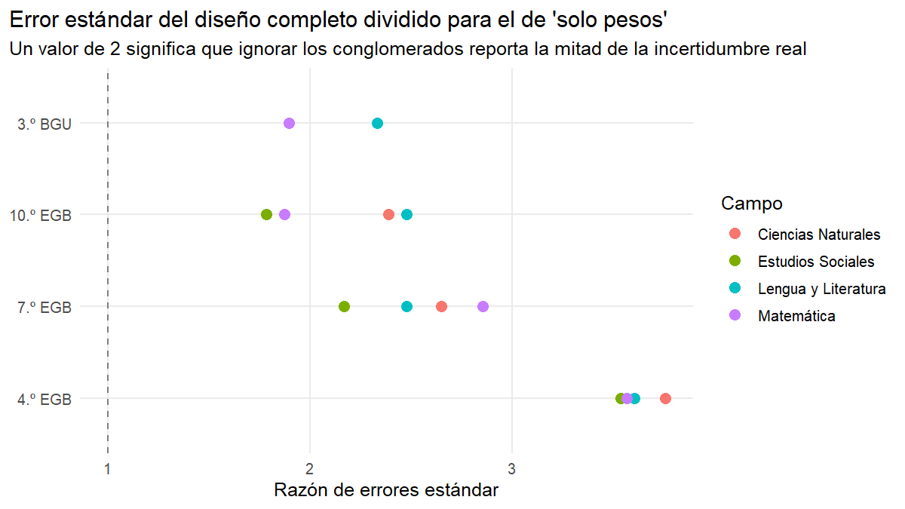
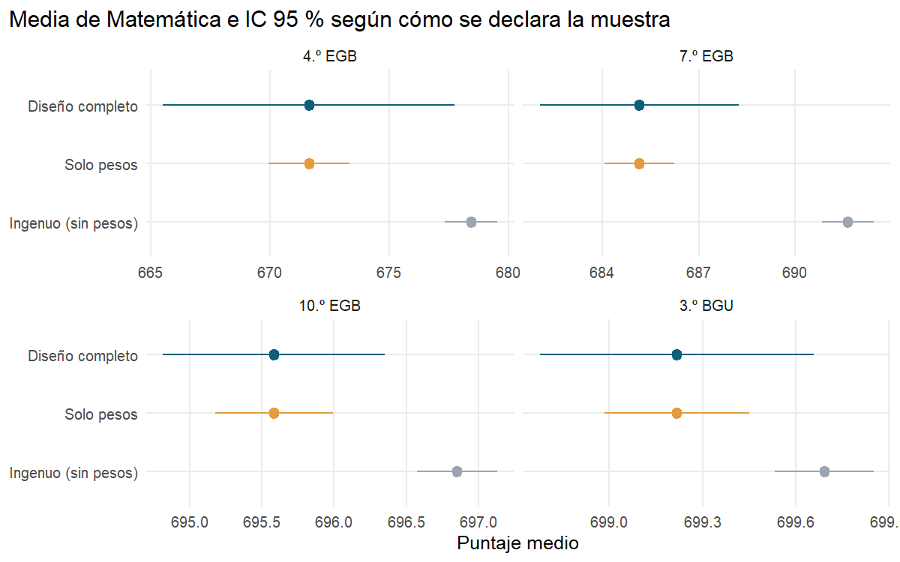
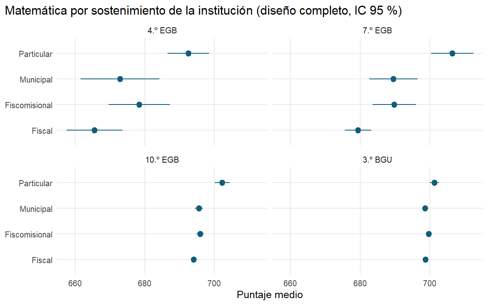

<p align="right"><b>English</b> · <a href="README.es.md">Español</a></p>

# How wrong is an analysis that ignores the sampling design? Evidence from Ecuador's national student assessment

An R analysis of the official microdata of **Ser Estudiante 2024-2025** (Ineval, 50,578 students, 1,197 schools) that compares three ways of declaring the same sample and shows, with the formulas and hand-made checks, why only one of them is correct.

[](https://github.com/Eduardo0602/muestreo-complejo-ser-estudiante/actions/workflows/verificaciones.yml)     

## The problem

Ser Estudiante is not a simple random sample. According to Ineval's methodological note, it is a **probabilistic, stratified, two-stage** design: schools are first selected (with probability proportional to size) within 16 strata (school calendar × area × funding), and then up to 35 students per school and grade. Each student carries a **sampling weight** per assessed subject.

These data are often analyzed in two incorrect ways:

| Approach | What it does | What it ignores |
|---|---|---|
| **Naive** | Simple sample mean | The weights and the design |
| **Weights only** | Uses the sampling weight, each student as an independent unit | That students come clustered in schools and strata |
| **Full design** | Strata, clusters (`amie`) and weights | Nothing essential (see Limitations) |

Question: **how much do the estimate and its uncertainty change with the approach chosen?**

## Data

Instituto Nacional de Evaluación Educativa (Ineval), *Ser Estudiante 2024-2025*, published on 15 December 2025 on [Ecuador's open data portal](https://www.datosabiertos.gob.ec/dataset/da1aeddc-3bd6-4399-a840-2f5ec67ba64e). The data are **not included** in this repository: the script downloads them from the official source. Anonymous student codes change between downloads, but the estimates do not.

## Mathematical foundation

Let $`U`$ be the population of $`N`$ students and $`y_k`$ the score of student $`k`$. The parameter is the population mean $`\bar{Y} = \frac{1}{N}\sum_{k\in U} y_k`$. Each student in the sample $`s`$ has a weight $`w_k`$ (the inverse of their inclusion probability, adjusted for non-response).

**Estimators.** The Horvitz–Thompson estimators of the total and of the population size, and the Hájek estimator of the mean, are

```math
\hat{Y} = \sum_{k\in s} w_k\, y_k, \qquad \hat{N} = \sum_{k\in s} w_k, \qquad \bar{y}_w = \frac{\hat{Y}}{\hat{N}}.
```

$`\bar{y}_w`$ is a ratio of two unbiased estimators, so it is not unbiased, but it is consistent and it is what `svymean` uses. The *weights only* and *full design* approaches give **exactly the same point estimate**; they differ only in the variance.

**Linearization variance.** A first-order Taylor expansion of the ratio gives $`\bar{y}_w - \bar{Y} \approx \frac{1}{N}\sum_{k\in s} w_k (y_k - \bar{Y})`$. With $`u_k = w_k (y_k - \bar{y}_w)/\hat{N}`$ and $`z_{hi}`$ the sum of the $`u_k`$ of school $`i`$ in stratum $`h`$, the variance estimator (schools treated as sampled with replacement within each stratum) is

```math
\hat{V}(\bar{y}_w) = \sum_{h=1}^{H} \frac{n_h}{n_h - 1} \sum_{i=1}^{n_h} \left(z_{hi} - \bar{z}_h\right)^2,
```

where $`n_h`$ is the number of schools in stratum $`h`$. The *weights only* approach is the special case $`H = 1`$ with each student as their own "school", and the naive one is $`s^2/n`$.

**Design effect.** $`\text{DEFF} = \hat{V}_{\text{design}} / \hat{V}_{\text{SRS}}`$ measures how many times more variance the design has than a simple random sample of the same size, and $`n_{\text{eff}} = n / \text{DEFF}`$ is the "equivalent" sample size. Kish's approximation separates its two causes:

```math
\text{DEFF} \approx \underbrace{\left(1 + \text{CV}_w^2\right)}_{\text{unequal weights}} \times \underbrace{\left(1 + (\bar{m} - 1)\,\rho\right)}_{\text{clustering}},
```

with $`\bar{m}`$ students per school and $`\rho`$ the intraclass correlation: how similar students of the same school are to each other.

## Results

**1. Without weights, the mean is biased.** Rural areas are over-represented in the sample (34.88 % of the sample versus 20.12 % of the estimated population). The naive mean exceeds the weighted one by **+0.4744 to +10.2424 points**, depending on grade and subject.

**2. Without clusters, uncertainty is understated 1.8 to 3.8 times.** The full-design standard error is **1.7843 to 3.7558 times** the one obtained by declaring weights only.



Example, Mathematics in 4th grade (12,129 students in 426 schools):

| Approach | Mean | Standard error | 95 % CI |
|---|---:|---:|---|
| Naive | 678.43243 | 0.55563 | [677.34331, 679.52156] |
| Weights only | 671.64233 | 0.87174 | [669.93359, 673.35107] |
| **Full design** | **671.64233** | **3.10976** | **[665.52927, 677.75540]** |

The correct interval is 3.57 times wider than the weights-only one, and the naive interval does not even contain the correct estimate.



**3. Why so much?** In 4th grade the full design effect reaches 32.64 in Mathematics (up to 38.44 in Natural Sciences): the 12,129 students are worth about **372 chosen at random**. Solving Kish's approximation, the intraclass correlation is $`\hat{\rho} \approx 0.43`$ (0.42683 rounded to 2 decimals): students of the same school are very similar, so each additional school brings far more information than each additional student. In 10th grade and high school $`\hat{\rho}`$ drops to values between 0.0698 and 0.1639 (an approximation, see Limitations).

**4. Domain comparisons with the correct uncertainty.** For example, in 4th-grade Mathematics private schools (692.49; 95 % CI [686.53, 698.45]) outperform public ones (665.58; [657.55, 673.61]). With the full design the intervals still do not overlap; in that same grade and subject, the comparisons by area and by school calendar have overlapping intervals and do not support claims of a difference.



All tables are in [`outputs/tablas/`](outputs/tablas/): means by design, comparison, domains, achievement levels and checks.

## Verification

[`R/05_verificaciones.R`](R/05_verificaciones.R) recomputes from scratch, for each grade and subject, the Hájek mean, the standard error of the three designs with the formula above and the absence of strata with a single school, and stops the analysis if anything differs from `survey`: **98 of 98 checks pass**. A [GitHub Actions workflow](.github/workflows/verificaciones.yml) reruns everything on a clean machine with the exact package versions on every change and on the first day of each month.

## How to reproduce

```r
# In R 4.5, from the project root (or by opening the .Rproj in RStudio):
install.packages("renv")
renv::restore()            # installs the exact versions recorded in renv.lock
source("R/99_run_all.R")   # downloads the official data and builds tables and figures (~1 min)
```

| Script | What it does |
|---|---|
| `00_setup.R` | Packages, paths, subjects and grades |
| `01_descargar_datos.R` | Downloads the official CSV and checks columns and records |
| `02_importar.R` | Reads, labels with the official codebook and builds the strata |
| `03_disenos.R` | Declares the three designs |
| `04_estimaciones.R` | Means, standard errors, DEFF, domains and achievement levels |
| `05_verificaciones.R` | Recomputes everything by hand |
| `06_figuras.R` | Figures |

## Project structure

```
muestreo-complejo-ser-estudiante/
├── R/                    # 00 → 06 and 99_run_all.R
├── outputs/tablas/       # results as CSV (including verificaciones.csv)
├── outputs/figuras/      # 3 figures
├── data/                 # created on run (not versioned)
├── renv.lock             # exact package versions
├── .github/workflows/    # automatic verification
├── muestreo-complejo-ser-estudiante.Rproj
└── LICENSE
```

## Limitations

- The variance treats schools as sampled **with replacement** and uses neither the finite population correction nor the exact probability-proportional-to-size selection: this is the standard approximation when stage-wise probabilities are not published, and it tends to be somewhat conservative.
- The sampling weights already include non-response adjustments that cannot be replicated without additional information from Ineval; here they are taken as given.
- Kish's decomposition is an approximation; $`\hat{\rho}`$ should be read as an order of magnitude, not an exact estimate.
- Following Ineval's recommendation, each subject is analyzed with its own weight and the overall average is not used.

## What I learned

- Weights and design solve different problems: weights correct **bias**, clusters and strata correct **variance**. Using weights only gives a correct point estimate with a fictitious precision.
- A DEFF of 30 means thousands of observations are worth a few hundred: the unit that carries information is the school, not the student.
- Checking every `survey` output against its formula is the best way to understand what the package does (and to catch a misdeclared design).

---

### Portfolio *From Mathematician to Data Scientist*

| Project | Question | Tools |
|---|---|---|
| **Complex survey sampling with Ser Estudiante** (this repository) | How wrong is an analysis that ignores the sampling design? | R, survey |
| [Messy-data EDA: deaths 2021](https://github.com/Eduardo0602/eda-limpieza-defunciones-ecuador-pandas-sql) | What must be fixed before trusting an official registry? | Python, pandas, SQL |
| [Linear regression from scratch](https://github.com/Eduardo0602/regresion-lineal-numpy-desde-cero) | Can a plane predict how deep Ecuador's earthquakes are? | Python, NumPy |
| [Visual linear algebra](https://github.com/Eduardo0602/algebra-lineal-visual-numpy) | What does a matrix do, geometrically? | Python, NumPy |

Eduardo Araque · Mathematician (Universidad Central del Ecuador) · [GitHub](https://github.com/Eduardo0602) · [LinkedIn](https://www.linkedin.com/in/eduardo-araque-j%C3%A1come-311b93235)
